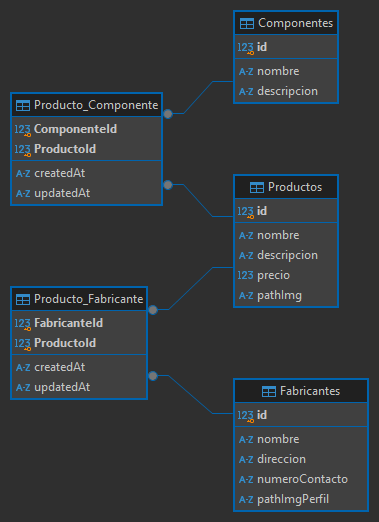

# Grupopersistencia - Trabajo Grupal 2

Estrategias de Persistencia 2c 2024, Universidad Nacional de Hurlingham

Este proyecto implementa una API rest desarrollada con Node.js y Mongo DB. Permite gestionar las operaciones CRUD sobre los recursos Producto, Fabricante y Componente, utilizando un ODM (Object-document mapping) Mongoose. Las funcionalidades desarrolladas en el proyecto permiten automatizar y gestionar de manera integrada los datos.

# Enfoques de relaciones en MongoDB

### Relación incrustada:

Utilizamos este tipo de relacion para los componentes dentro del esquema de producto, este diseño pierde la capacidad de poder manejar los endpoints de componentes de una manera independiente, esto puede generar una pérdida frente a acceso directo de los mismos.
Si el documento crece significativamente puede afectar al rendimiento de las consultas.

### Relación referenciada:

Nos parecio adecuado utilizar este tipo de relacion ya que nos permite gestionar los datos de manera más eficiente evitando la duplicación inncesaria. Puede ofrecer a futuro beneficios en términos de escalabilidad y rendimiento.
Se logra mantener una consistencia entre las referencias y los documentos.

# Tecnologías utilizadas

- ODM Mongoose
- Node.js
- Express
- Nodemon

# Instalacion y ejecución de la API rest:

### Requisitos previos:

- Node.js
- npm (Node Package Manager)
- Docker
- Mongodb

### Pasos para la ejecución:

Ejecute los siguiente comandos para correr la API en la máquina local

- Clonar el repositorio remoto

  `https://github.com/EP-2024C2/tp-mongo-grupopersistencia.git`

- Instalar dependencias dentro del directorio del proyecto

  `npm i`

- Dentro del archivo package.json incluir el siguiente script

  `"start": "node src/app.js",`

- Inicializar la API

  `npm start`

- Si desea usar un entorno de desarrollo como nodemon, debe inicializar la API con

  `npm run dev`

## Modelo Relacional

El proyecto presenta el siguiente diagrama de entidad-relación (DER)

## Desarrolladores

- Albornoz Elizabeth
- Britez Juan Manuel
- Chebeste Alexis
- Díaz Gonzalo
- Galdin Santino
- Gómez Maximiliano
